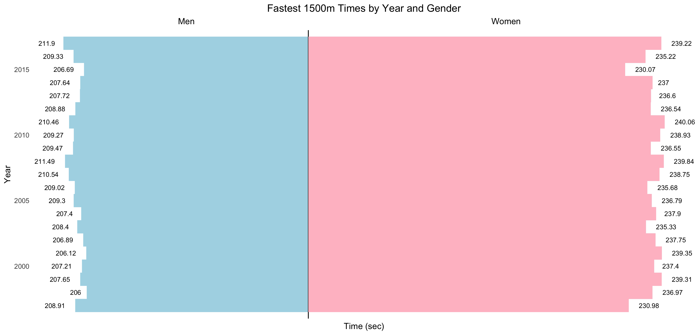
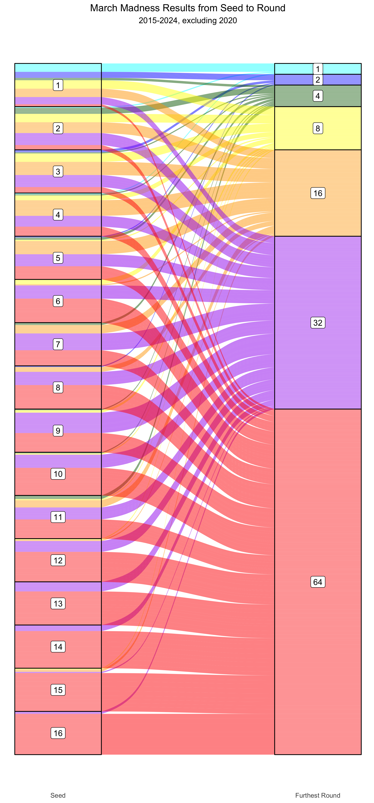
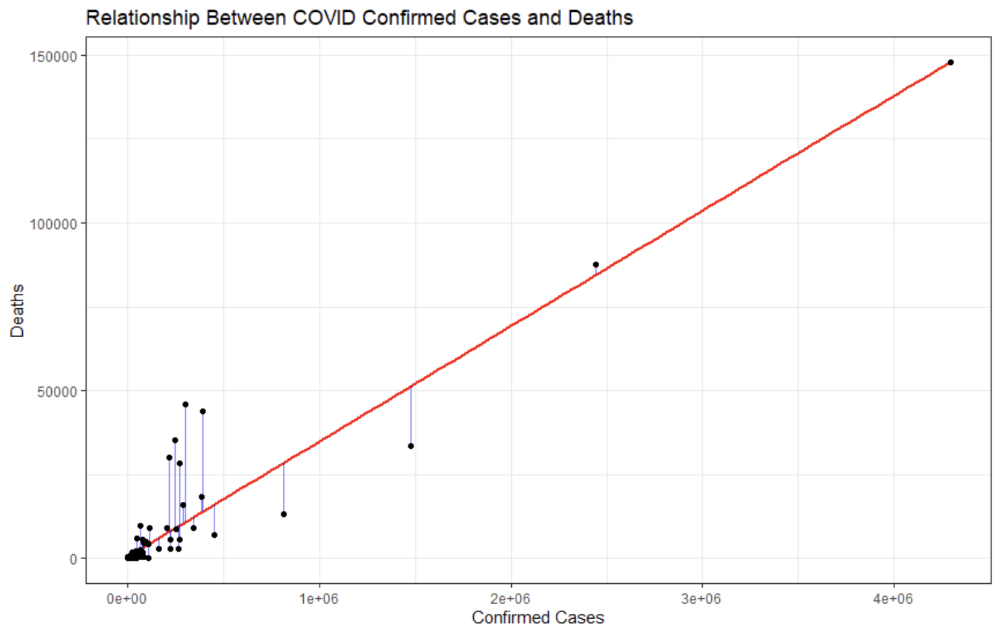
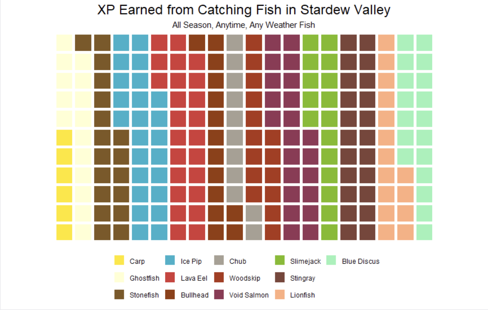
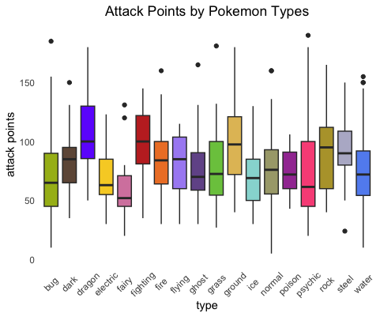
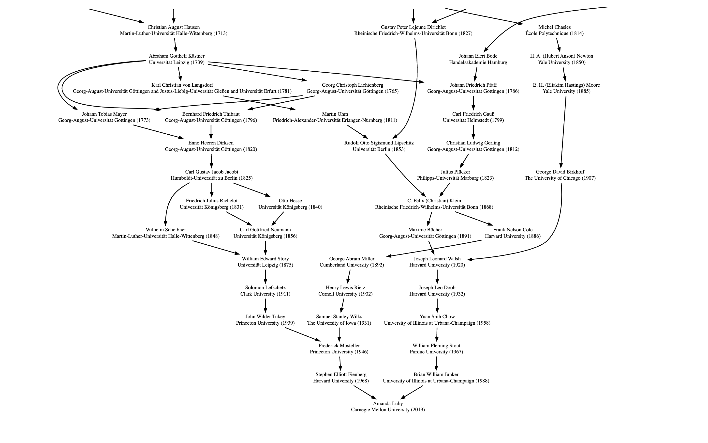
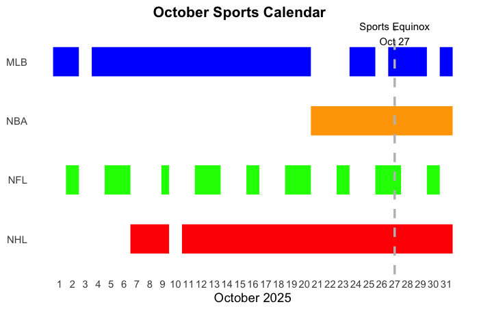
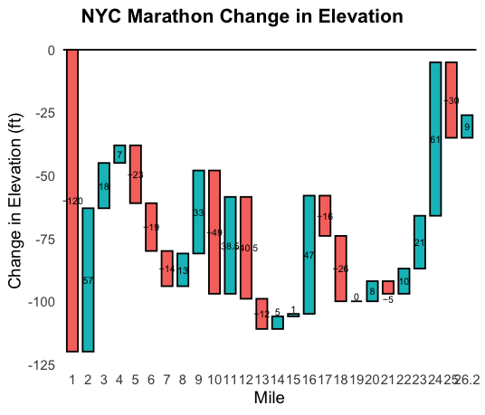

# Monthly Data Viz Challenges

This is a personal repo to holds data sets and any code associated with a monthly data viz challenge that an internal team at M&T Bank is hosting!

## February 2025: Tornado Plot

The February 2025 data viz challenge prompt is to create a butterfly diagram / tornado chart / population pyramid.
"This visualization type is a horizontal bar chart that plots data points opposite each other. Depending on how it's
sorted, the visual will look like a butterfly or tornado. This structure makes it very easy to compare two data points.
As such, it's often used in sensitivity analysis and is effective for visualization comparisons."

In honor of the world record for the men's indoor mile being broken by Yared Nuguse on February 8, 2025 (I just found
out that Jakob Ingebrigtsen broke this record on February 13, 2025 lol), I made a tornado plot for fastest 1500m time by
year and gender from 1997-2017. The data is from [Kaggle](https://www.kaggle.com/datasets/jguerreiro/running?resource=download),
and the code for data cleaning and the plot are all done in R. Note that 1500m is 100m less than a mile, but the data
set I used only had Olympic distances, which does not include the mile/1600m.

## March 2025: Sankey Plot

The March 2025 data viz challenge prompt is to create a Sankey chart. "Per Copilot: Sankey charts are incredibly useful
for visualizing the flow of data or resources through a system. They are particularly effective in highlighting the
magnitude of flows between different stages or entities."

I made a Sankey plot to show March Madness teams' seeds/rankings and the furthest round they made it to from 2015-2024
(excluding 2020). Data is from [Kaggle](https://www.kaggle.com/datasets/nishaanamin/march-madness-data?select=TeamRankings.csv).
The code for data cleaning and the plot are all done in R.

## April 2025: Scatterplot

The April 2025 data viz challenge prompt is to create a scatter plot plus. "This month we will be exploring scatter plots. Scatter
plots are a great tool to visualize the relationship between two variables, identify patterns, and determine correlation strength
and direction. The Plus (+) is an ask to include at least one piece of extra functionality or analysis in addition to the x, y
relationship."

I made a scatterplot to show how a linear regression line is fitted with the least squares method. I'm plotting confirmed COVID cases
and deaths by country with the black dots. The red line is the line of best fit. The blue lines are the residuals (distance between
observed [black dots] and fitted values [red line]), and linear regression works by minimizing the sum of the squares of the
residuals to find the line of best fit! Data is from [Kaggle](https://www.kaggle.com/datasets/imdevskp/corona-virus-report). The code
for data cleaning and the plot are all done in R.

## June 2025: Waffle Chart

The June 2025 data viz challenge prompt is to create a waffle chart. "Per AI: Waffle charts are beneficial because they offer a
visually appealing and easily understandable way to represent categorical data, particularly when showing parts-to-whole relationships.
They are a good alternative to pie charts, especially for showing progress towards a target or highlighting the contribution of
different categories to a whole."

I made a waffle chart on the XP earned from catching all season, anytime, any weather fish in Stardew Valley! Looks like I should be
going for Ice Pips or Lava Eels. Data is from [Kaggle](https://www.kaggle.com/datasets/jessicaebrown/stardew-valley-full-catelog?select=fish_detail.csv). The code for data cleaning and the plot are all done in R.

## August 2025: Quartile Plus visualization

The August 2025 data viz challenge prompt is to make a quartile plus visualization. "Quartile analysis, often depicted with box and
whisker plots, is a great tool for understanding large data sets. Often, it can be crucial for getting a macro level view of data
distribution. It can be especially helpful at measuring relative 'performance' and identifying outliers."

I made box and whisker plots for Pokemon attack points by Pokemon main type! If you're looking for Pokemon with high attack, it looks
like you should get some dragon or ground type Pokemon. The data is from [Tidy Tuesday](https://github.com/rfordatascience/tidytuesday/blob/main/data/2025/2025-04-01/readme.md). If you're unfamiliar with Tidy Tuesday, it's a weekly social data project that originated
within the R community. Each week, they release a new data set that participants can use to create visualizations. It's another great
place to find fun, unique, and relatively clean data sets!

## October 2025: Network Graph

The October 2025 data viz challenge prompt is to make either a visualization that is either a network graph / diagram or focused on an
October holiday. "Per AI: Network graphs are excellent for understanding complex systems and data by visualizing relationships between
entities, revealing hidden patterns, and facilitating data integration. They are used across many industries to identify influencers
in social networks, detect fraud, optimize supply chains, analyze biological systems, and proactively manage telecommunications
infrastructure."

If you're a math nerd like me and ever thought about doing a PhD in math, you might be familiar with the [Math Genealogy Project](https://www.genealogy.math.ndsu.nodak.edu/).
It's a website where you can look up math (or statistics) professor, their advisors, their advisors' advisors, etc. For my October
challenge, I wanted to create a math genealogy chart of my first Statistics professor at college, [Amanda Luby](https://aluby.github.io/).
She is the person who got me into statistics, R, and data visualizations, so she's literally the reason for me being here! (Also she does
really cool research in statistics & forensic fingerprint analysis that I would recommend checking out if you're interested)

I also want to use this challenge to highlight why R Studio is cool! So, you can access the math genealogy data through an API, but also
someone has created a package in R that you can install and use that is pretty user friendly! Here are a couple links to the
maths.genealogy package documentation: [CRAN](https://cran.r-project.org/web/packages/maths.genealogy/index.html) and [README](https://cran.r-project.org/web/packages/maths.genealogy/readme/README.html).
All I had to do was use their search_id function, type in Amanda's name, and use their plot function to get her math genealogy. I ended 
up with a huge genealogy chart. Unfortunately, it was a bit hard to customize this chart because it was all wrapped in a package. Ideally,
I would have just cut it off at advisors from the year 1800 & onward, but I wasn't able to figure out how to do that, so I just cropped
the chart to that level manually. But before you write off R, I just wanted to highlight that another cool part of the maths.genealogy
package is you can ask it to find the shortest path between two math PhD's genealogy!

## November 2025: Gantt Chart

The November 2025 data viz challenge prompt is to build a Gantt chart! "Gantt charts provide a visual timeline of resource allocation and
progress tracking for projects or other endeavors. Often, they can be critical for project or workflow management."

My submission for this month's viz challenge is a recreation of a (handdrawn) visual I saw on @_sportsball 's profile on Instagram. They 
were discussing the "sports equinox," which is the one day a year where all 4 major North American professional sports leagues (NFL, MLB, 
NBA, and NHL) play on the same day, usually in late October. (I know there are lots of other professional sports out there, including 
women's sports, but this was a specific @_sportsball visual that I wanted to recreate.) As you can see, this year's sports equinox laned on
October 27!

## January 2026: Waterfall Chart

The January 2026 data viz challenge prompt is to create a Waterfall Chart! "Waterfall Charts are great for showing change in composition
over time. They can be especially helpful for financial analysis (e.g. visualizinng a profit and loss statement or showing year over year
changes). That is because the structure can simplify complex data by providing a clear visualization of impacts. Also they have a cool name
and are cool to look at."

My submission for this month's data viz challenge is a waterfall chart of the NYC Marathon (net) change in elevation! My data came from the
very scientific method of finding the marathon route on Strava, jotting down the elevation at each mile marker, and then subtracting the
elevations (ex: mile 1 elevation - mile 0 elevation, mile 2 elevation - mile 1 elevation, etc.). It doesn't show more granular changes in
elevation in between the miles, but if you look just at net change, it looks like you get a huge downhill in the beginning, and then many
uphills from miles 22-24. Data and visual created in R (there's a handy "waterfalls" package / library that lets you create waterfall
charts super easily)!

